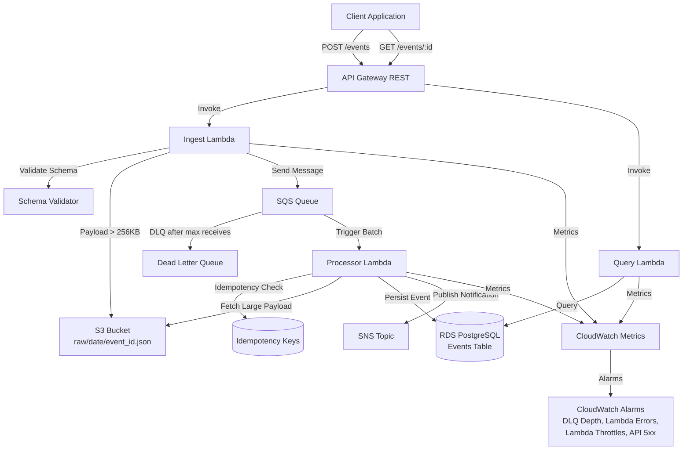

# Fluxa

**Fluxa v1.0.0** — feature-complete, production-grade reference implementation

Fluxa is a cloud-native, event-driven data platform built on AWS to ingest, process, and persist asynchronous events using serverless architectures, message queues, and Infrastructure as Code. The system is designed for high reliability, scalability, and observability with built-in retry mechanisms, dead-letter queues, idempotency guarantees, and comprehensive monitoring.

## Architecture



For detailed architecture documentation, see [docs/ARCHITECTURE.md](docs/ARCHITECTURE.md).

## Quick Start

### Prerequisites

- Go 1.21 or later
- Terraform 1.0 or later
- AWS CLI configured with appropriate credentials
- PostgreSQL client (for database migrations)

### Local Development Setup

1. **Clone the repository:**

   ```bash
   git clone https://github.com/yourusername/fluxa.git
   cd fluxa
   ```

2. **Install dependencies:**

   ```bash
   make deps
   ```

3. **Run tests (no AWS credentials required):**

   ```bash
   make test
   ```

4. **Lint code:**

   ```bash
   make lint
   ```

5. **Build Lambda functions:**

   ```bash
   make build
   ```

6. **Package Lambda functions:**
   ```bash
   make package
   ```

### Local Test Harness

Test the full flow locally without AWS:

1. **Start local PostgreSQL:**

   ```bash
   make local-up
   ```

2. **Run local test harness:**

   ```bash
   make local-test
   ```

   This will:

   - Create test event
   - Test idempotency (same event_id processed twice = one row only)
   - Verify CheckAndMark correctly detects already-processed events
   - Query event from database

3. **Stop local PostgreSQL:**
   ```bash
   make local-down
   ```

### Deployment to AWS (Dev Environment)

#### Prerequisites

- AWS CLI configured with appropriate credentials
- Terraform 1.0+ installed
- Go 1.21+ (for building Lambda functions)

#### Step-by-Step Deployment

1. **Build and package Lambda functions:**

   ```bash
   make package
   ```

   This creates ZIP files in `dist/` directory.

2. **Configure Terraform variables:**

   ```bash
   cd infra/terraform/envs/dev
   cp terraform.tfvars.example terraform.tfvars
   ```

   Edit `terraform.tfvars`:

   ```hcl
   aws_region = "us-east-1"
   db_username = "fluxa_admin"
   db_password = "CHANGE_ME_STRONG_PASSWORD"

   lambda_ingest_zip_path = "../../../../dist/ingest.zip"
   lambda_processor_zip_path = "../../../../dist/processor.zip"
   lambda_query_zip_path = "../../../../dist/query.zip"
   ```

3. **Configure Terraform backend (optional but recommended):**

   Edit `main.tf` to configure S3 backend, or use local state for testing:

   ```hcl
   backend "s3" {
     bucket = "your-terraform-state-bucket"
     key    = "fluxa/dev/terraform.tfstate"
     region = "us-east-1"
   }
   ```

4. **Initialize Terraform:**

   ```bash
   terraform init
   ```

5. **Review planned changes:**

   ```bash
   terraform plan
   ```

6. **Apply infrastructure:**

   ```bash
   terraform apply
   ```

   This will create:

   - RDS PostgreSQL instance (db.t3.micro)
   - S3 bucket for payloads
   - SQS queue + DLQ
   - SNS topic
   - API Gateway REST API
   - Lambda functions (ingest, processor, query)
   - CloudWatch alarms
   - IAM roles and policies

7. **Get deployment outputs:**

   ```bash
   terraform output api_endpoint
   terraform output db_endpoint
   terraform output sqs_queue_url
   ```

8. **Run database migrations:**

   Connect to RDS and run migrations:

   ```bash
   export DB_HOST=$(terraform output -raw db_endpoint | cut -d: -f1)
   export DB_USER=$(terraform output -raw db_username)
   export DB_PASSWORD="your_password"
   export DB_NAME="fluxa"

   psql -h $DB_HOST -U $DB_USER -d $DB_NAME -f ../../../../migrations/001_create_events_table.sql
   psql -h $DB_HOST -U $DB_USER -d $DB_NAME -f ../../../../migrations/002_create_idempotency_keys_table.sql
   ```

### Verify Deployment

1. **Check API Gateway health endpoint:**

   ```bash
   API_ENDPOINT=$(terraform output -raw api_endpoint)
   curl $API_ENDPOINT/health
   ```

   Expected: `{"status":"healthy"}`

2. **Ingest a test event:**

   ```bash
   curl -X POST $API_ENDPOINT/events \
     -H "Content-Type: application/json" \
     -H "X-Correlation-ID: test-$(date +%s)" \
     -d '{
       "user_id": "test_user",
       "amount": 99.99,
       "currency": "USD",
       "merchant": "Test Merchant",
       "timestamp": "'$(date -u +%Y-%m-%dT%H:%M:%SZ)'",
       "metadata": {"source": "verification_test"}
     }'
   ```

   Save the returned `event_id`.

3. **Query the event (wait a few seconds for processing):**

   ```bash
   EVENT_ID="<event_id_from_step_2>"
   curl $API_ENDPOINT/events/$EVENT_ID
   ```

4. **Check CloudWatch metrics:**

   - Open AWS Console → CloudWatch → Metrics
   - Namespace: `Fluxa/Ingest`, `Fluxa/Processor`, `Fluxa/Query`
   - Verify metrics: `ingest_success`, `processed_success`, `sqs_sent`

5. **Check CloudWatch Logs:**

   - Open AWS Console → CloudWatch → Log Groups
   - Look for `/aws/lambda/fluxa-ingest-dev`, `/aws/lambda/fluxa-processor-dev`, `/aws/lambda/fluxa-query-dev`
   - Verify structured JSON logs with correlation IDs

6. **Verify SQS queue:**

   ```bash
   QUEUE_URL=$(terraform output -raw sqs_queue_url)
   aws sqs get-queue-attributes --queue-url $QUEUE_URL --attribute-names ApproximateNumberOfMessages
   ```

7. **Check CloudWatch alarms:**
   - Open AWS Console → CloudWatch → Alarms
   - Verify alarms are created (should be in OK state initially)
   - Alarms: `fluxa-dlq-depth-dev`, `fluxa-ingest-errors-dev`, etc.

For production deployment, see the [prod environment configuration](infra/terraform/envs/prod/).

## API Examples

### Ingest Event

```bash
curl -X POST https://your-api-id.execute-api.us-east-1.amazonaws.com/dev/events \
  -H "Content-Type: application/json" \
  -H "X-Correlation-ID: my-correlation-id" \
  -d '{
    "user_id": "user123",
    "amount": 99.99,
    "currency": "USD",
    "merchant": "Amazon",
    "timestamp": "2024-01-15T10:30:00Z",
    "metadata": {
      "source": "web",
      "campaign": "summer_sale"
    }
  }'
```

**Response:**

```json
{
  "event_id": "550e8400-e29b-41d4-a716-446655440000",
  "status": "enqueued"
}
```

### Query Event

```bash
curl -X GET https://your-api-id.execute-api.us-east-1.amazonaws.com/dev/events/550e8400-e29b-41d4-a716-446655440000 \
  -H "X-Correlation-ID: my-correlation-id"
```

**Response:**

```json
{
  "event_id": "550e8400-e29b-41d4-a716-446655440000",
  "correlation_id": "my-correlation-id",
  "user_id": "user123",
  "amount": 99.99,
  "currency": "USD",
  "merchant": "Amazon",
  "timestamp": "2024-01-15T10:30:00Z",
  "metadata": {
    "source": "web",
    "campaign": "summer_sale"
  },
  "payload_mode": "INLINE",
  "created_at": "2024-01-15T10:30:01Z"
}
```

### Health Check

```bash
curl https://your-api-id.execute-api.us-east-1.amazonaws.com/dev/health
```

**Response:**

```json
{
  "status": "healthy"
}
```

## Observability

### Metrics

The system emits custom CloudWatch metrics using Embedded Metric Format:

**Ingest Lambda:**

- `ingest_success` - Successful event ingestions
- `ingest_failure` - Failed event ingestions
- `s3_puts` - Number of large payloads stored in S3
- `sqs_sent` - Messages successfully enqueued

**Processor Lambda:**

- `processed_success` - Successfully processed events
- `processed_failure` - Failed processing attempts
- `db_latency_ms` - Database operation latency

**Query Lambda:**

- `query_success` - Successful queries
- `query_failure` - Failed queries
- `query_not_found` - 404 responses

### CloudWatch Alarms

The following alarms are configured:

1. **DLQ Depth Alarm** - Triggers when messages appear in Dead Letter Queue
2. **Lambda Error Rate** - Triggers when error rate exceeds threshold
3. **Lambda Throttles** - Triggers when Lambda functions are throttled
4. **API Gateway 5xx Errors** - Triggers when API returns 5xx errors

### Structured Logging

All logs are emitted in JSON format with correlation IDs for end-to-end tracing:

```json
{
  "timestamp": "2024-01-15T10:30:00Z",
  "level": "INFO",
  "correlation_id": "550e8400-e29b-41d4-a716-446655440000",
  "message": "Successfully enqueued event",
  "fields": {
    "event_id": "550e8400-e29b-41d4-a716-446655440000",
    "payload_mode": "INLINE"
  }
}
```

## Reliability Features

### Schema Validation

Events are validated at ingestion time to prevent invalid data from entering the system.

### Idempotency

The processor Lambda implements idempotency checks using a dedicated `idempotency_keys` table. Events are identified by `event_id`, and duplicate processing attempts are safely skipped.

### Retry with Exponential Backoff

SQS automatically retries failed messages with exponential backoff. The visibility timeout is set to 6x the Lambda timeout to prevent messages from becoming visible during processing.

### Dead Letter Queue

Messages that fail after maximum receive count (3) are moved to a Dead Letter Queue for manual investigation and remediation. See [docs/RUNBOOK.md](docs/RUNBOOK.md) for DLQ handling procedures.

### Correlation IDs

Correlation IDs are propagated end-to-end:

- Generated or extracted from request headers at API Gateway
- Included in SQS message attributes
- Logged in all structured logs
- Stored in database records

### Payload Integrity

All payloads include SHA-256 hashes for integrity verification. Large payloads (>256KB) are stored in S3 to reduce SQS message size while maintaining integrity checks.

## Cost Notes

### Estimated Monthly Costs (Dev Environment, Low-Medium Load)

- **Lambda**: ~$5-20 (depends on invocations and memory)
- **SQS**: ~$1-5 (first 1M requests free)
- **S3**: ~$1-10 (depends on payload size and access patterns)
- **RDS**: ~$15-50 (db.t3.micro to db.t3.small)
- **API Gateway**: ~$3.50 per million requests
- **CloudWatch**: ~$5-15 (logs and metrics)

**Total**: ~$30-100/month for dev environment

### Cost Optimization

- Small payloads (≤256KB) are stored inline in SQS to avoid S3 costs
- Large payloads are stored in S3 with lifecycle policies (90-day expiration)
- Serverless architecture means you only pay for actual usage
- Consider RDS Reserved Instances for predictable production workloads

## Project Structure

```
fluxa/
├── cmd/                    # Lambda function entry points
│   ├── ingest/            # Event ingestion Lambda
│   ├── processor/         # Event processing Lambda
│   └── query/             # Event query Lambda
├── internal/              # Internal packages
│   ├── config/           # Configuration management
│   ├── db/               # Database operations
│   ├── idempotency/      # Idempotency logic
│   ├── logging/          # Structured logging
│   ├── metrics/          # CloudWatch metrics
│   ├── models/           # Data models
│   ├── queue/            # SQS operations
│   └── storage/          # S3 operations
├── migrations/            # Database migrations
├── infra/                # Infrastructure as Code
│   └── terraform/
│       ├── modules/
│       │   ├── stateless/ # Stateless resources (Lambda, SQS, S3, etc.)
│       │   └── stateful/  # Stateful resources (RDS)
│       └── envs/
│           ├── dev/      # Dev environment
│           └── prod/     # Prod environment
├── docs/                 # Documentation
│   ├── ARCHITECTURE.md   # Architecture details
│   ├── RUNBOOK.md        # Operational procedures
│   └── TRADEOFFS.md      # Design decisions and tradeoffs
├── scripts/              # Utility scripts
│   ├── seed_events.sh    # Seed sample events
│   └── load_test.sh      # Load testing script
└── .github/
    └── workflows/
        └── ci.yml        # GitHub Actions CI pipeline
```

## Makefile Targets

- `make help` - Show available targets
- `make build` - Build all Lambda functions
- `make test` - Run all tests with coverage
- `make lint` - Run golangci-lint
- `make clean` - Remove build artifacts
- `make package` - Package Lambda functions as ZIP files
- `make terraform-fmt` - Format Terraform files
- `make terraform-validate` - Validate Terraform configuration
- `make deploy-dev` - Prepare deployment to dev (requires terraform apply)
- `make deploy-prod` - Prepare deployment to prod (requires terraform apply)
- `make ci` - Run all CI checks (lint, test, terraform)

## Development

### Running Tests

```bash
make test
```

Tests don't require AWS credentials and can run locally.

### Database Migrations

Apply migrations to your database:

```bash
psql -h $DB_HOST -U $DB_USER -d $DB_NAME -f migrations/001_create_events_table.sql
psql -h $DB_HOST -U $DB_USER -d $DB_NAME -f migrations/002_create_idempotency_keys_table.sql
```

### Local Testing with Scripts

```bash
# Seed sample events
export API_ENDPOINT=https://your-api-id.execute-api.us-east-1.amazonaws.com/dev
./scripts/seed_events.sh

# Run load test
./scripts/load_test.sh
```

## Documentation

- [Architecture](docs/ARCHITECTURE.md) - System architecture and data flow
- [Runbook](docs/RUNBOOK.md) - Operational procedures and troubleshooting
- [Tradeoffs](docs/TRADEOFFS.md) - Design decisions and alternatives

## Portfolio Proof

Use this checklist to verify a successful deployment:

- [ ] **Terraform Apply**: Infrastructure deploys successfully (`terraform apply` completes)
- [ ] **Migrations**: Database migrations run without errors
- [ ] **Ingest**: POST /events returns `event_id` and status 'enqueued'
- [ ] **Query**: GET /events/{event_id} returns event data within 30 seconds
- [ ] **CloudWatch Metrics**: Metrics show `ingest_success` and `processed_success` in CloudWatch console
- [ ] **Alarms**: All CloudWatch alarms in OK state (no DLQ messages, no Lambda errors)

Run `./scripts/verify_dev.sh` for automated verification after deployment.

### Metrics to Replace Placeholders

After deployment and load testing, replace placeholders in resume bullets with actual captured metrics:

| Metric                      | Placeholder | How to Capture                                                    | Notes                          |
| --------------------------- | ----------- | ----------------------------------------------------------------- | ------------------------------ |
| `ingest_p95_ms`             | TBD         | CloudWatch Metrics → Fluxa/Ingest → `ingest_latency_ms` p95       | API Gateway + Lambda latency   |
| `process_p95_ms`            | TBD         | CloudWatch Metrics → Fluxa/Processor → `process_latency_ms` p95   | End-to-end processing latency  |
| `throughput_events_per_min` | TBD         | Load test script output OR CloudWatch `ingest_success` sum/minute | System throughput              |
| `terraform_apply_minutes`   | TBD         | Time `terraform apply` command execution                          | Infrastructure deployment time |
| `end_to_end_async_p95_ms`   | TBD         | Custom script (ingest time to query time) - Optional              | Full async pipeline latency    |

**See `docs/METRICS_CAPTURE.md` for detailed step-by-step instructions on capturing these metrics.**

**Run load test**: `./scripts/load_test.sh` or `NUM_EVENTS=2000 CONCURRENCY=50 ./scripts/load_test.sh`

## License

MIT License - see [LICENSE](LICENSE) for details.

## Releases

Fluxa uses semantic versioning. Releases are created automatically when tags matching `v*` are pushed to the repository.

### Creating a Release

1. **Ensure all tests pass**:

   ```bash
   make ci
   ```

2. **Update version and release notes**:

   - Update version in `RELEASE_NOTES.md`
   - Update version notice in `README.md` if needed

3. **Create and push tag**:

   ```bash
   git tag -a v1.0.0 -m "Release v1.0.0"
   git push origin v1.0.0
   ```

4. **GitHub Actions will automatically**:
   - Run tests and linting
   - Create a GitHub Release with `RELEASE_NOTES.md` content
   - Attach release notes to the release

### Release Workflow

The `.github/workflows/release.yml` workflow:

- Triggers on tag push matching `v*`
- Runs all tests and linting checks
- Creates GitHub Release with release notes
- Fails if tests or linting fail (prevents broken releases)

See [RELEASE_NOTES.md](RELEASE_NOTES.md) for the latest release information.

## Contributing

1. Fork the repository
2. Create a feature branch
3. Make your changes
4. Run `make ci` to ensure all checks pass
5. Submit a pull request

## Security

- IAM roles follow least-privilege principles
- Database credentials stored in AWS Secrets Manager
- S3 bucket is private with encryption at rest
- SQL queries use parameterized statements
- VPC security groups restrict network access

For security concerns, please contact the maintainers.
