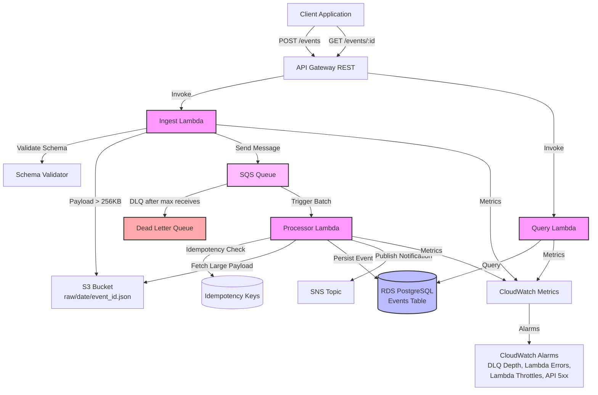

# Fluxa Architecture

## Overview

Fluxa is a cloud-native, event-driven data platform that ingests, processes, and persists asynchronous events using AWS serverless services. The system is designed for high reliability, scalability, and observability with built-in retry mechanisms, dead-letter queues, idempotency guarantees, and comprehensive monitoring.

## System Architecture

## Data Flow

### 1. Event Ingestion

1. Client sends `POST /events` to API Gateway with event payload
2. API Gateway invokes Ingest Lambda with request
3. Ingest Lambda:
   - Validates JSON schema against event model
   - Generates `event_id` (UUID) if not provided
   - Generates `correlation_id` for end-to-end tracing
   - Calculates payload size:
     - **≤ 256KB**: Includes full payload inline in SQS message with SHA-256 hash
     - **> 256KB**: Stores raw payload in S3 (`raw/YYYY-MM-DD/event_id.json`) and includes only `s3_bucket` + `s3_key` in SQS message
   - Sends message to SQS queue with:
     - Message body: `event_id`, `correlation_id`, `payload_mode` (INLINE|S3), `payload_inline` (optional), `payload_sha256`, `s3_bucket` (optional), `s3_key` (optional), `received_at`
     - Message attributes: `correlation_id`, `event_id`
   - Emits CloudWatch metrics: `ingest_success`, `ingest_failure`, `s3_puts`, `sqs_sent`

### 2. Event Processing

1. SQS triggers Processor Lambda with batch of messages (up to 10)
2. For each message:
   - Validates message contract
   - Performs idempotency check:
     - Queries `idempotency_keys` table by `event_id`
     - If already processed: skips safely (idempotent)
     - If processing: marks attempt with timestamp and increments attempts counter
   - Fetches payload:
     - If `payload_mode == "INLINE"`: uses `payload_inline` from message
     - If `payload_mode == "S3"`: fetches from S3 using `s3_bucket` and `s3_key`
   - Validates payload SHA-256 hash for integrity
   - Persists to `events` table in PostgreSQL with parameterized SQL
   - Publishes SNS notification with `event_id` and `status`
   - Updates idempotency record with success status
   - Emits metrics: `processed_success`, `processed_failure`, `db_latency_ms`

### 3. Error Handling

- **Transient errors** (DB connection, network): Returns error so SQS retries with exponential backoff
- **Permanent errors** (validation failures): Logs error and allows message to go to DLQ after max receives
- **DLQ processing**: Requires manual intervention (see RUNBOOK.md)

### 4. Event Querying

1. Client sends `GET /events/{event_id}` to API Gateway
2. API Gateway invokes Query Lambda
3. Query Lambda queries PostgreSQL `events` table by `event_id`
4. Returns event data or 404 if not found

## Key Components

### AWS Services

- **API Gateway (REST)**: HTTP API endpoints
- **Lambda (Go)**: Serverless compute for ingest, process, and query operations
- **SQS + DLQ**: Message queue with dead-letter queue for failed messages
- **SNS**: Notification service for event processing completion
- **S3**: Object storage for large payloads (>256KB)
- **RDS PostgreSQL**: Relational database for event persistence
- **CloudWatch**: Logging, metrics, and alarms

### Reliability Features

- **Schema Validation**: Prevents invalid events from entering the system
- **Idempotency**: Prevents duplicate processing via `idempotency_keys` table
- **Retry with Exponential Backoff**: SQS automatic retries with configurable backoff
- **Dead Letter Queue**: Captures messages that fail after max retries
- **Correlation IDs**: End-to-end tracing via message attributes and logs
- **Payload Integrity**: SHA-256 hash verification for payloads

### Security

- **Least-Privilege IAM**: Lambda roles have minimum required permissions
- **Parameterized SQL**: Prevents SQL injection attacks
- **Secrets Management**: AWS SSM Parameter Store or Secrets Manager for sensitive data
- **S3 Private Bucket**: Payload storage with encryption at rest

### Observability

- **Structured Logging**: JSON logs with correlation IDs
- **CloudWatch Metrics**: Custom metrics using embedded metric format
- **CloudWatch Alarms**:
  - DLQ message depth
  - Lambda error rates
  - Lambda throttles
  - API Gateway 5xx errors

## Scalability

- **Auto-scaling**: Lambda and SQS automatically scale based on load
- **Batch Processing**: Processor Lambda processes up to 10 messages per invocation
- **Payload Optimization**: Large payloads stored in S3 to reduce SQS message size
- **Database Connection Pooling**: Efficient PostgreSQL connection management

## Cost Optimization

- **Serverless**: Pay only for actual usage
- **Payload Strategy**: Small payloads inline (no S3 costs), large payloads in S3 (minimal SQS message size)
- **Reserved Capacity**: Consider RDS Reserved Instances for predictable workloads

