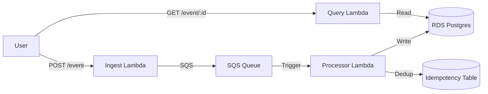

# Fluxa Demo & Walkthrough

This guide provides a step-by-step walkthrough to verify Fluxa's functionality, from local testing to operational drills.

## 1. System Overview

Fluxa is a high-throughput, idempotent event processing system.
- **Ingest**: Validates and enqueues events (API Gateway -> Lambda -> SQS).
- **Process**: De-duplicates and persists events (SQS -> Lambda -> RDS/S3).
- **Query**: Retrieves event status (API Gateway -> Lambda -> RDS).



## 2. Local Verification (Fastest)

Run the full integration suite locally using Docker.

```bash
# 1. Start dependencies (Postgres)
make local-up

# 2. Run the integration harness (Go test + Real logic)
make local-test
# Expected Output: verify "HAPPY PATH", "IDEMPOTENCY", "SCHEMA VALIDATION" all PASS.
```

## 3. Deployment (AWS)

Deploy the infrastructure to a development environment.

```bash
# 1. Validate Infra
make terraform-validate

# 2. Deploy
make deploy-dev
# confirm "yes" at prompt
```

Outputs will provide the API Gateway URL, e.g., `https://xyz.execute-api.us-east-1.amazonaws.com/dev`.

## 4. End-to-End Verification

### A. Happy Path
**Action**: Send a valid event.
```bash
API_URL="https://xyz.execute-api.us-east-1.amazonaws.com/dev"
curl -X POST "$API_URL/event" \
  -H "X-Correlation-ID: demo-001" \
  -d '{
    "user_id": "u_123",
    "amount": 100.50,
    "currency": "USD",
    "merchant": "DemoCorp",
    "timestamp": "'$(date -u +%Y-%m-%dT%H:%M:%SZ)'"
  }'
```
**Expectation**: HTTP 202 Accepted, returns `{ "event_id": "..." }`.

### B. Idempotency Check
**Action**: Send the *exact same* payload again.
**Expectation**: HTTP 202 Accepted (Ingest accepts it), but **Processor** logs will show "Duplicate event detected, skipping".
**Verify**: Check logs or Query API (next step).

### C. Query Status
**Action**: Retrieve the event.
```bash
curl "$API_URL/event/YOUR_EVENT_ID"
```
**Expectation**: HTTP 200 OK, JSON body includes `"status": "completed"` and `"payload_mode": "inline"`.

## 5. Failure Drills (Ops Validation)

### Scenario: Invalid Payload (Schema Enforcement)
**Action**: Send an event with missing `amount`.
```bash
curl -X POST "$API_URL/event" -d '{"user_id": "u_1", "currency": "USD"}'
```
**Expectation**: HTTP 400 Bad Request. Ingest rejects it immediately.

### Scenario: Poison Pill (Simulated)
*Note: This requires access to the internal SQS queue or manually modifying the processor code to fail, which is harder to demo strictly via API. Alternatively, verify via `make local-test` which runs the `TestProcessor_HashMismatch` checks.*

## 6. Observability

### Debugging
Go to **CloudWatch Logs Insights** and run:
```sql
fields @timestamp, service, stage, status, error_code, latency_ms
| filter correlation_id = "demo-001"
| sort @timestamp asc
```
**Result**: See the full trace from `ingest` (validate -> enqueue) to `processor` (process -> persist).

### Operational Triage
See [RUNBOOK.md](../docs/RUNBOOK.md) for handling DLQ alerts.

## 7. Metrics
CloudWatch Metrics -> Browse -> Namespace "Fluxa" -> Service "ingest/processor".
- Check `ingest_success` count.
- Check `latency_ms` stats.
